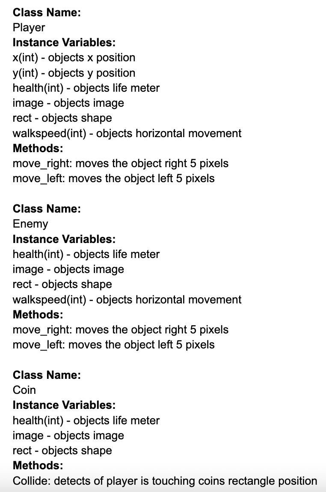

:warning: Everything between << >> needs to be replaced (remove << >> after replacing)
# CS110 Project Proposal
# Rectangle Game     
## CS 110 Final Project
### Fall, 2022
### [Assignment Description](https://docs.google.com/document/d/1H4R6yLL7som1lglyXWZ04RvTp_RvRFCCBn6sqv-82ps/edit?usp=sharing)

Repl: https://github.com/bucs110FALL22/final-project-joel-and-rita

Slides: https://docs.google.com/presentation/d/1pHtiUgSAh_-SqB-I_52aSkTC_DIXeIVEB5euAW2OPGs/edit#slide=id.gca4537879_0_15

### Team: The Supreme Coders

#### Joel Luna, Wut Yee Pearl Phoo
***

## Project Description

We're going to be creating a platform user interactive game, which is similar to Mario Bros.
***    

## User Interface Design

- **Initial Concept**
  - << A wireframe or drawing of the user interface concept along with a short description of the interface. You should have one for each screen in your program. For example, if your program has a start screen, game screen, and game over screen, you should include a wireframe / screenshot / drawing of each one and a short description of the components. >>
  - RectangleGameDemo.png
    
    
- **Final GUI**
  - << You should also have a screenshot of each screen for your final GUI >>

***        

## Program Design

* Non-Standard libraries
    Pygame:
    https://www.pygame.org/docs/
      pygame is a module that is used to create games with python.
* Class Interface Design
    * << A simple drawing that shows the class relationships in your code (see below for an example). This does not need to be overly detailed, but should show how your code fits into the Model/View/Controller paradigm. >>
        *  
* Classes
    Class Player: Creates main player where the user can interact with with game by inputting keys
    Class Enemy: Creates enemies that moves left and right
    Class Coin: Creates coins that can be collected by the player class
    

## Project Structure and File List

The Project is broken down into the following file structure:

* main.py
* src
    * << all of your python files should go here >>
* assets
    * << all of your media, i.e. images, font files, etc, should go here) >>
* etc
    * << This is a catch all folder for things that are not part of your project, but you want to keep with your project >>
***

## Tasks and Responsibilities 
Rita: Planning, setting the coins and bullet, and ending
Joel: Planning, setting the player, ground and titlescreen

## Testing

* << Describe your testing strategy for your project. >>

## ATP

| Step                 |Procedure             |Expected Results                   |
|----------------------|:--------------------:|----------------------------------:|
| Step 1                   
| Procedure: Run the program, after troubleshooting and fixing errors | 
| Expected Results: GUI Program appears on screen |

| Step 2                  
| Procedure: Press the controls to check if they perform their function correctly |
| Expected Results: Player moves on game screen as it is supposed to |

| Step 3                  
| Procedure: Player collides with coins |
| Expected Results: Score increases and coin disappears as player collects each coin |

| Step 4                  
| Procedure: Player collides with enemies, which are the bullets and the muncher on top of the tower |
| Expected Results: Game over screen appears and player is prompted to start over or end game |

| Step 5                  
| Procedure: Player collects 4 coins |
| Expected Results: Game over screen appears and player is prompted to start over or end game |

